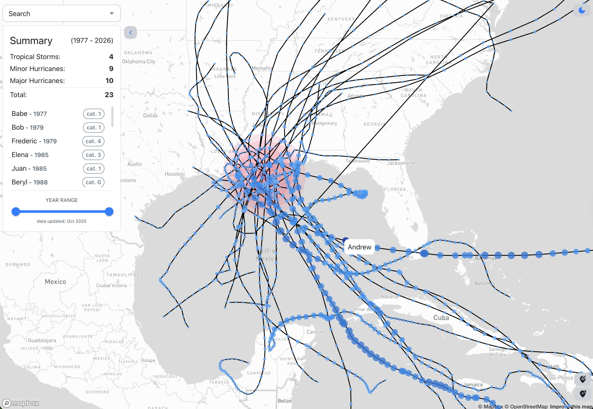
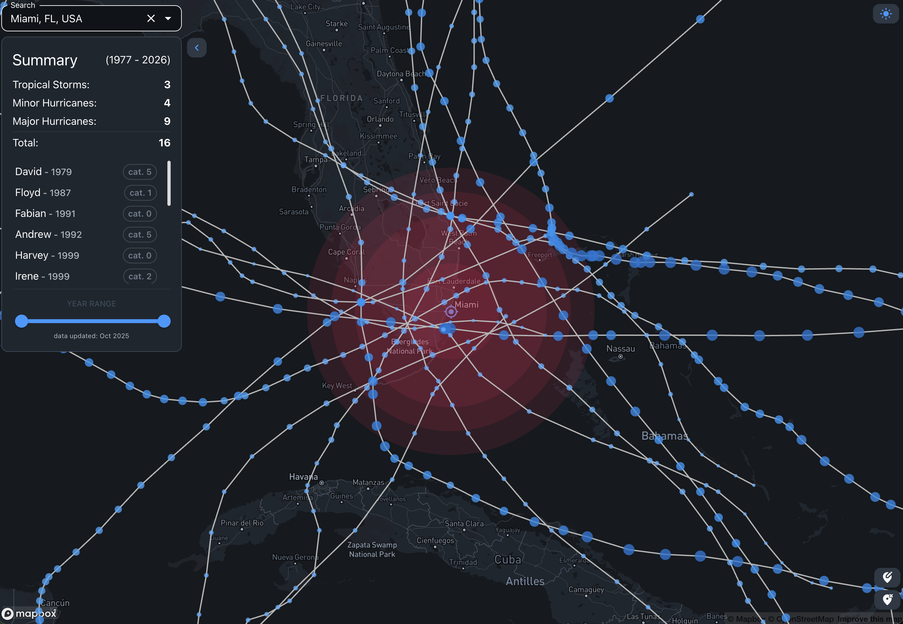

# Historical Paths

A simple map displaying hurricane tracks which passed within a certain distance of a location.

Given a location, the query selects events according the following criteria:

- Category 5 within 150 miles
- Category 3-5 within 125 miles
- Category 1-2 within 100 miles
- Category 0 within 50 miles

Originally intended to help homeowners understand the frequency and severity of hurricanes at their location.

## :earth_americas: Data

Data source: [NOAA International Best Track Archive for Climate Stewardship (IBTrACS)](https://www.ncei.noaa.gov/products/international-best-track-archive)

### Pipeline

Kestra data pipeline is run monthly to update Cockroach DB with data from NOAA. The data is filtered to North Atlantic and Western Pacific basins and events that achieved a minimum usa_sshs of 0.

:jigsaw: [noaa-hurricanes-pipeline repo](https://github.com/scarlson1/noaa-hurricanes-pipeline)

## :bust_in_silhouette: Usage

Search by:

- :round_pushpin: clicking on the map (use controls in the bottom to toggle mode or clear map)
- :mag: search by address/location in top right





## :technologist: Development

**Firebase functions**

```bash
cd functions & npm install
# start function emulators
npm run dev
```

- sets service account path as env var (`export GOOGLE_APPLICATION_CREDENTIALS=[PATH_TO_SERVICE_ACCOUNT].json`)
- `firebase emulators:start --only functions,auth`
- `tsc --watch`

To switch between projects, use [firebase alias](https://firebase.google.com/docs/cli#project_aliases). Configure environment variables in env files to match project alias: `.env.[ALIAS]`

```bash
firebase use [alias]
```

**React**

```bash
cd client & npm run dev
# same as: vite --mode development
```

[Vite](https://vite.dev/) will load environment variables [matching the mode](https://vite.dev/guide/env-and-mode) (`.env.development` or `.env.development.local`)

**Env Vars**

Firebase functions env vars

`.env.[project]`

- `DB_USER`
- `DB_HOST`
- `DB_DATABASE`
- `DB_PORT`

GCP Secret Manager or .env.local

- `DB_PASSWORD`

React env vars

`.env`

- `VITE_FB_API_KEY`
- `VITE_FB_AUTH_DOMAIN`
- `VITE_FB_PROJECT_ID`
- `VITE_FB_STORAGE_BUCKET`
- `VITE_FB_MESSAGING_SENDER_ID`
- `VITE_FB_APP_ID`

`.env.local` / `.env.prod`

- `VITE_GOOGLE_GEO_KEY` (for search)
- `VITE_MAPBOX_ACCESS_TOKEN` (for map)

---

## :file_cabinet: Cockroach DB

`hurricane_data` table:

```sql
name VARCHAR(12) NOT NULL,
sid VARCHAR(13) NOT NULL,
basin VARCHAR(10) NOT NULL,
season INT8 NOT NULL,
iso_time VARCHAR(23) NOT NULL,
usa_sshs INT8 NULL,
nature VARCHAR(2) NOT NULL,
latitude DECIMAL(8,5) NOT NULL,
longitude DECIMAL(9,5) NOT NULL,
usa_status VARCHAR(2) NULL,
"timestamp" TIMESTAMPTZ NOT NULL,
point_id UUID NOT NULL DEFAULT gen_random_uuid(),
rowid INT8 NOT VISIBLE NOT NULL DEFAULT unique_rowid(),
year INT2 NULL AS (season) STORED,
category INT2 NULL AS (usa_sshs) STORED,
"geometry" GEOMETRY(POINT,4326) NULL AS (st_geomfromtext(((('POINT(':::STRING || longitude) || ' ':::STRING) || latitude) || ')':::STRING, 4326:::INT8)) STORED,
"geography" GEOGRAPHY(POINT,4326) NULL AS (st_geographyfromtext(((('POINT(':::STRING || longitude) || ' ':::STRING) || latitude) || ')':::STRING, 4326:::INT8)) STORED,
unique_row_id VARCHAR(50) NULL,
CONSTRAINT hurricane_data_pkey PRIMARY KEY (rowid ASC),
INDEX hurricane_data_sid_idx (sid ASC),
INDEX hurricane_data_season_idx (season ASC),
INDEX hurricane_data_iso_time_idx (iso_time ASC),
INDEX hurricane_data_usa_sshs_idx (usa_sshs ASC),
INDEX hurricane_data_year_idx (year ASC),
INVERTED INDEX geom_idx_1 ("geometry"),
INVERTED INDEX geog_idx_1 ("geography"),
UNIQUE INDEX unique_row (unique_row_id ASC)
```

**(Computed columns)[https://www.cockroachlabs.com/docs/stable/computed-columns]**: point_id, rowid, geometry, geography

- computed columns cannot be written to directly
- `STORED`: computed when the data is added/updated and stored within the table

**Spatial Indexes**

(CockroachDB spatial index docs)[https://www.cockroachlabs.com/docs/stable/spatial-indexes]

Indexing Spatial indexes operate on 2-dimensional data types (`GEOMETRY` & `GEOGRAPHY`). They're stored as a special type of (GIN index)[https://www.cockroachlabs.com/docs/v26.1/inverted-indexes].

The geometry/geography are automatically calculated by Cockroach from the latitude and longitude columns.

The `INVERTED INDEX`

TODO: consider (tuning index)[https://www.cockroachlabs.com/docs/stable/spatial-indexes#index-tuning-parameters] (doesn't require extremely accurate location in query)

`sid`, `year`, `iso_time`, `usa_sshs` are used in the query and all indexed as well.

**Events Query**

The event path query returns the following data structure:

```typescript
interface EventProfile {
  name: string;
  year: string;
  id: string;
  category: string;
  path: {
    // for easily passing to deckGL
    lng: number;
    lat: number;
  }[];
  track: {
    datetime: string;
    coordinates: number[];
    point_id: string;
    id: string;
    category: number;
    year: number;
    name: string;
  }[];
}
```

The response is enriched with:

- triggerCategory: maximum category event registered within the radius (outlined above - radius is category dependent) of the location
- summary by category/year (tropical storm, minor hurricane, major hurricane)

Query:

Inner Query:

- get storm IDs for any events within the following distances:
  - category 0: 50 miles
  - category 1-2: 100 miles
  - category 3-4: 125 miles
  - category 5: 150 miles

```sql
WHERE
  sid IN (
    SELECT sid
    FROM hurricane_data
    WHERE
      usa_sshs IN (0)
      AND ST_DWithin (ST_GeographyFromText('POINT(${lng} ${lat})'), geography, 80467) -- 80467 meters = 50 miles
  )
  OR sid in ... -- category 1-2 within 100 miles
  OR sid in ... -- category 3-4  within 125 miles
  OR sid in ... -- category 5  within 150 miles
  GROUP BY sid
```

Build aggregate by storm (WHERE sid matched inner query above):

```sql
WITH hurricanes AS (
  SELECT
    MIN(name) as name,
    CAST(MIN(season) AS int) as year,
    MIN(sid) as id,
    MAX(usa_sshs) as category,
    ARRAY_AGG(
      json_build_object(
        'coordinates', array[longitude, latitude],
        'datetime', TO_CHAR(timestamp, 'Mon FMDD, YYYY FMHH:MI am'),
        'category', usa_sshs,
        'id', sid,
        'point_id', point_id,
        'name', name,
        'year', season
      )
      ORDER BY iso_time ASC
    ) AS track,
    ARRAY_AGG(
      JSON_BUILD_ARRAY(longitude, latitude)
      ORDER BY iso_time ASC
    ) AS path
  FROM hurricane_data
```

Return events:

```sql
SELECT * FROM hurricanes ORDER BY year ASC
```

Full Query:

```sql
WITH hurricanes AS (
    -- format hurricanes in the structure we want to return (aggregated datapoints by event (sid))
    SELECT
      MIN(name) as name,
      CAST(MIN(season) AS int) as year,
      MIN(sid) as id,
      MAX(usa_sshs) as category,
      ARRAY_AGG(
        json_build_object(
          'coordinates', array[longitude, latitude],
          'datetime', TO_CHAR(timestamp, 'Mon FMDD, YYYY FMHH:MI am'),
          'category', usa_sshs,
          'id', sid,
          'point_id', point_id,
          'name', name,
          'year', season
        )
        ORDER BY iso_time ASC
      ) AS track,
      ARRAY_AGG(
        JSON_BUILD_ARRAY(longitude, latitude)
        ORDER BY iso_time ASC
      ) AS path
    FROM hurricane_data

    WHERE
      -- category 0: 80467 meters = 50 miles
      sid IN (
        SELECT sid
        FROM hurricane_data
        WHERE
          usa_sshs IN (0)
          AND ST_DWithin (ST_GeographyFromText('POINT(${lng} ${lat})'), geography, 80467)
      )
      -- category 1-2 within 100 miles
      OR sid IN (
        SELECT sid
        FROM hurricane_data
        WHERE
          usa_sshs IN (1,2)
          AND ST_DWithin (ST_GeographyFromText('POINT(${lng} ${lat})'), geography, 160934)
      )
      -- category 3-4  within 125 miles
      OR sid IN (
        SELECT sid
        FROM hurricane_data
        WHERE
          usa_sshs IN (3,4)
          AND ST_DWithin (ST_GeographyFromText('POINT(${lng} ${lat})'), geography, 201168)
      )
      -- category 5 within 150 miles
      OR sid IN (
        SELECT sid
        FROM hurricane_data
        WHERE
          usa_sshs IN (5)
          AND ST_DWithin (ST_GeographyFromText('POINT(${lng} ${lat})'), geography, 241402)
      )
    GROUP BY sid
  )

SELECT * FROM hurricanes ORDER BY year ASC
```

## :rocket: Deployment

**Client**

```bash
cd functions
npm run deploy:dev # or npm run deploy:prod
# firebase use dev
# vite build
# firebase deploy --only hosting
```

**Firebase functions**

```bash
npm run build # rm -rf ./dist/ && tsc
npm run deploy # firebase deploy --only functions
```

TODO: deploy from github actions
